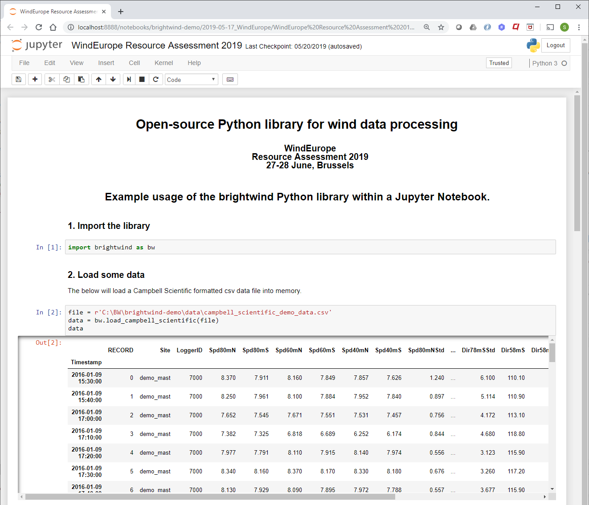

--------------
```
     __         _       __    __           _           __
    / /_  _____(_)___  / /_  / /__      __(_)___  ___ / /
   / __ \/ ___/ / __ \/ __ \/ __/ | /| / / / __ \/ __  /
  / /_/ / /  / / /_/ / / / / /_ | |/ |/ / / / / / /_/ /
 /_.___/_/  /_/\__, /_/ /_/\__/ |__/|__/_/_/ /_/\__,_/
              /____/
 ```
--------------

<br>

The brightwind python library aims to **empower wind resource analysts** and establish a common **industry standard toolset**.

<br>

Example usage is shown below via a Jupyter Notebook.
<br>

<p>



</p>


<br>

### Documentation

Documentation on how to get setup and use the library can be found at https://brightwind-dev.github.io/brightwind-docs/

<br>

##### Features
The library provides wind analysts with easy to use tools for working with
meteorological data. It supports loading of meteorological data, averaging,
filtering, plotting, correlations, shear analysis, long term adjustments, etc.
The library can export a resulting long term adjusted tab file to be used in
other software.

<br>

##### Benefits
The key benefits to an open-source library is that it provides complete transparency
and traceability. Anyone in the industry can review any part of the code and suggest changes,
thus creating a standardised, validated toolkit for the industry.

By default, during an assessment every manipulation or adjustment made to the wind data is
contained in a single file. This can easily be reviewed and checked by internal reviewers or,
as the underlying code is open-sourced, there is no reason why this file cannot be sent to
3rd parties for review thus increasing the effectiveness of a banks due diligence.

<br>

##### License
The library is licensed under the GNU Lesser General Public License v3.0. It is the
intention to allow commercial products or services to be built on top of this
library but any modifications to the library itself should be kept open-sourced.
Keeping this open-sourced will ensure that the library becomes the de facto
library used by wind analysts, establishing a common, standard industry wide
toolset for wind data processing .

<br>

---
### Installation

The library can be installed by using pip install from the command line (for those that have pip installed).

<br>

```
C:\Users\Stephen> pip install brightwind
```

<br>

For those that do not already have Puthon or pip installed please follow this tutorial,
[getting started with Windows](https://brightwind-dev.github.io/brightwind-docs/tutorials/Getting_Started_Stable_Development.html),
to get set up.

<br>

---
### Test datasets
A test dataset is included in this repository and is used to test functions in the code. The source of the dataset is:

<br>

| Dataset            | Source           | Notes  |
|:------------------ |:-------------|:-----|
| Demo data          | Anonymous | A modified 2 year met mast dataset in various logger formats along with associated 18-yr MERRA-2 data. |
| Offshore-CREYAP-2  | [Offshore-CREYAP-2-Data-pack](http://www.ewea.org/events/workshops/past-workshops/resource-assessment-2015/offshore-creyap-part-ii/) | Two offshore met masts with MERRA data. |
| CREYAP Pt II       | [CREYAP-Pt-2](http://www.ewea.org/events/workshops/past-workshops/resource-assessment-2015/offshore-creyap-part-ii/)      | Onshore 50m met mast from the CREYAP Pt II along with additional MERRA-2 reference data  |

<br>

---
### Contributing
If you wish to be involved or find out more please contact stephen@brightwindanalysis.com.

More information can be found on the [documentation](https://brightwind-dev.github.io/brightwind-docs) website.

<br>
